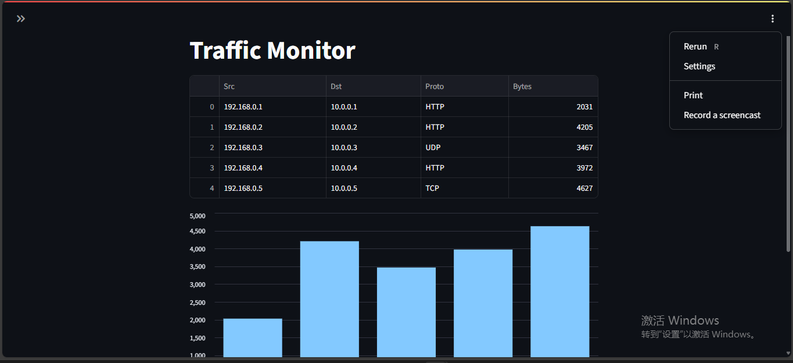
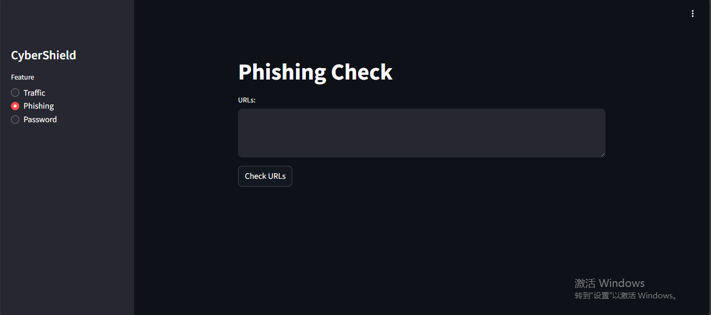
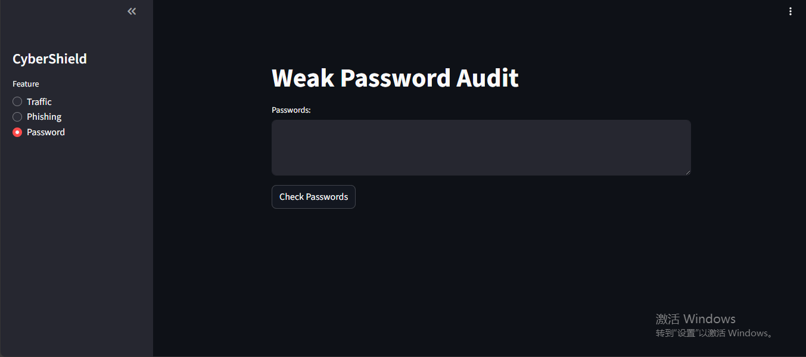

# CyberShield

## Project Overview
CyberShield is a small project I built in high school to explore how basic cybersecurity tools work in practice.  
I wanted something simple that could show network activity and common security risks in a way that students like me could understand.

## Key Features
- **Traffic Monitor (Simulation Mode)** – Displays simulated network traffic in real time, helping visualize potential threats.  
- **Phishing URL Check** – Detects suspicious URLs and flags potential phishing attempts.  
- **Weak Password Audit** – Tests password strength and highlights weak passwords for better security awareness.

## Project Screenshots

### Traffic Monitor

### Phishing URL Check

### Weak Password Audit

## Sample Database Files
- [Traffic Monitor CSV](docs/exports/traffic_log_sample.csv)  
- [Phishing Check CSV](docs/exports/phishing_check_sample.csv)  
- [Password Audit CSV](docs/exports/password_audit_sample.csv)

## Project Overview
CyberShield is a small project I built in high school to explore how basic cybersecurity tools work in practice.  
I wanted something simple that could show network activity and common security risks in a way that students like me could understand.

## How to Run
pip install -r requirements.txt 

python -m streamlit run app.py
